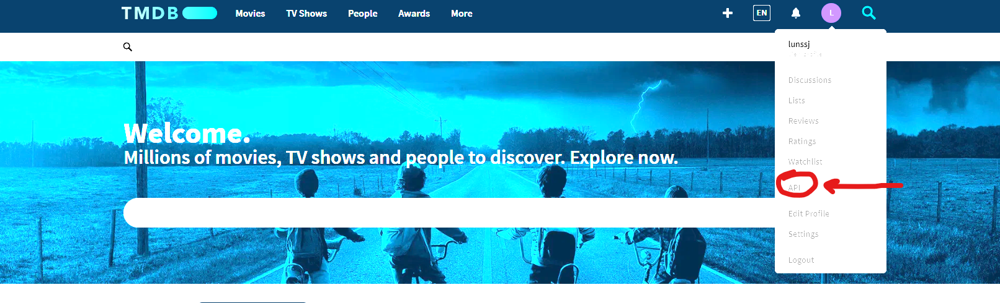

## Disable Cinemeta
1. On Nuvio, Open Settings>General>Content & Discovery>Addons 
2. Delete the addon named Cinemeta.
## TorBox API
1. Create an account for TorBox
2. Sign up for a $3/month subscription. 
3. Obtain API key—needed for AIOStreams.
## Additional API Keys (Required)
1. Create accounts for TMDb, TVDb, and MDBList. **SAVE LOGINS FOR EACH**
2. Then Request an API for each—you will need these API keys for AIOMetadata.
### TMDb
Apply for the API using random information—it really does not matter, you just need the key.
	
### TVDb
Apply for the API using random information—it really does not matter, you just need the key.
	
	
### MDBList
1. Click the dropdown menu with your name. Head to Preferences>API Access, and click generate API key.
## AIOStreams
1. Skip any presets it suggests and use a custom setup—set it up myself. 
2. Scroll down and select Advanced for Interface.
	
3. On the left first go to Save & Install to create a configuration. Make a password for it to create it (save this too). Skip the install to Stremio menu.
4. Then go down to where you see import and use my preset to import my settings/filters. Click on Import Config.
	
5. On the left, click the Services tab. Select the settings icon for TorBox and put in your API key and click save. (make sure it is toggled on). 
	
	
6. Go back to the Save & Install tab on the left and click save. 
7. There should be a Direct Manifest URL, copy it and go back to Nuvio. 
8. Open Settings>General>Content & Discovery>Addons 
	
9. Paste the manifest json URL and click add addon. You should now see a new add-on named AIOStreams.
## AIOMetadata
1. Skip any presets it suggests and use a custom setup—there should be a skip button.
	
2. On the left first go to the Configuration tab to create a configuration. Make a password for it to create it (I recommend using the same as AIOStreams).
3. Then go down to where you see import configuration and use the file below to import my settings.
	
4. Then on the left go to the Integrations tab, and paste in your API keys for TMDb and TVDb. Test your keys and make sure they both have a green check mark.
	
5. Go to the Catalogs tab on the left, and click the little logo for Simkl (small s) to link your Simkl account.
	
6. Click the Art Providers tab on the left, visit BetterPosters.
	1. Click Get Started. Then click AIOMetadata/Other Addon.
		
	2. Scroll down and copy the URL.
		
7. Head back to AIOMetadata and paste this URL in the bottom of the Art Providers tab, where it says Poster URL Pattern—replace existing if there is one.
	
8. Go back to the Configuration tab on the left and click save configuration.
9. There should be a manifest json URL, copy it and go back to Nuvio.
10. Open Settings>General>Content & Discovery>Addons
	
11. Paste the manifest json URL and click add addon. You should now see a new add-on named AIOMetadata.
**MAKE SURE AIOMETADATA IS YOUR VERY FIRST ADDON ON THE TOP OF THE LIST (USE THE ARROW)**
## PenguPlay (Optional, backup)
1. Connect your google account.
2. Click copy addon URL, and go back to Nuvio.
	
3. Open Settings>General>Content & Discovery>Addons
	
4. Paste the manifest json URL and click add addon.
